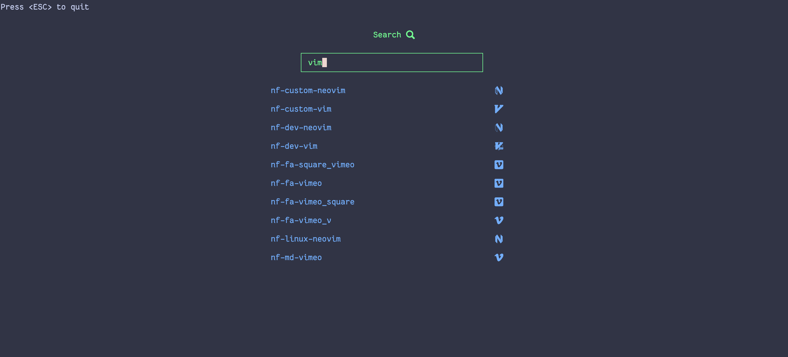

# Term icons

Map Unicode glyphs to names.

## Note:

This package is _not_ ready yet!
Nevertheless, you can use it.

To search for icons on your terminal, use the "search.py" program provided.
It's just a _quick and dirty_ solution and still need a lot of work, but it works just fine.

TODO:

A lot!

But first: I've provided a pkg with all the consts (over 10K LOC...) and I've also provided smaller
packages grouping icons, so you just import the group you need (i.e. all FA icons). I've used
abbreviated names for those, so I need to give those packages a proper name.
